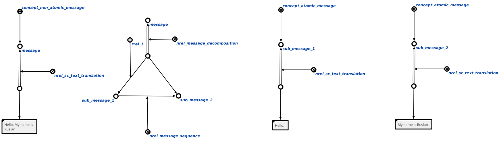

Message decompotsiton module for OSTIS
============

About
------------
This is message decompotsiton module for OSTIS. More info about installation and etc. you can find on [ostis-example-app](https://github.com/ostis-apps/ostis-example-app).

Result of decompotsiton saves to knowledge base in structure that displayed below:

Requirements
------------

For requirements installation use

    pip3 install -r requirements.txt

After that:

    python3 -m spacy download en_core_web_md
    python3 -m spacy download de_core_news_md

---
**NOTE**

Install `pip3` before. For this use:

    sudo apt install python3-pip

---

Installation
------------

Add this lines to `CMakeLists.txt`:

	add_subdirectory(NonAtomicMessageDecompositionAgent)